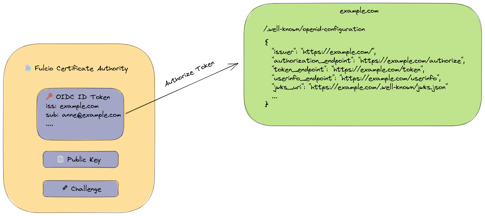
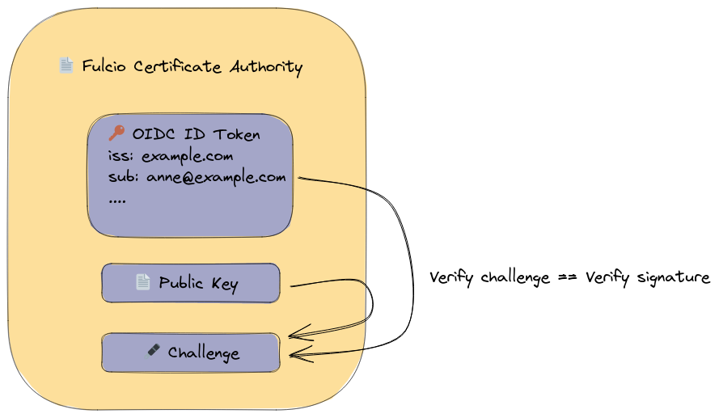
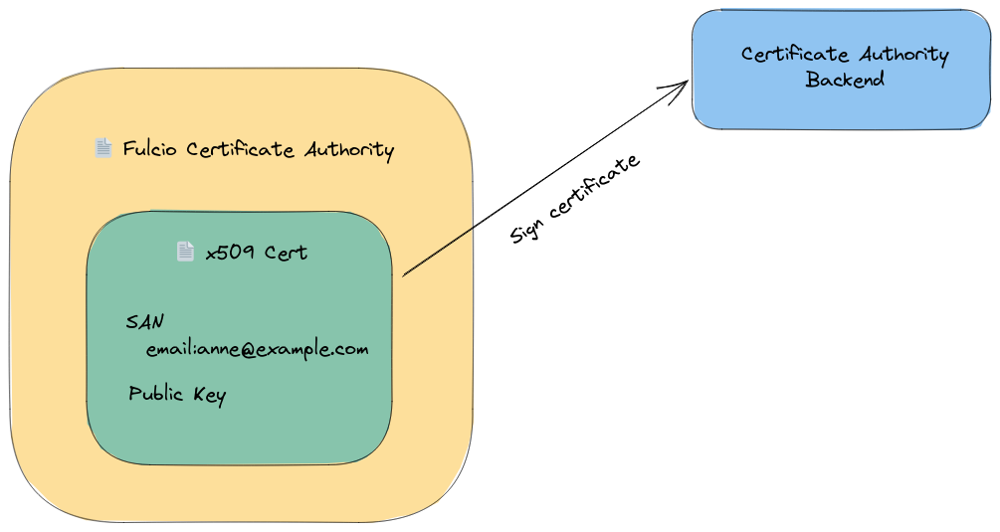
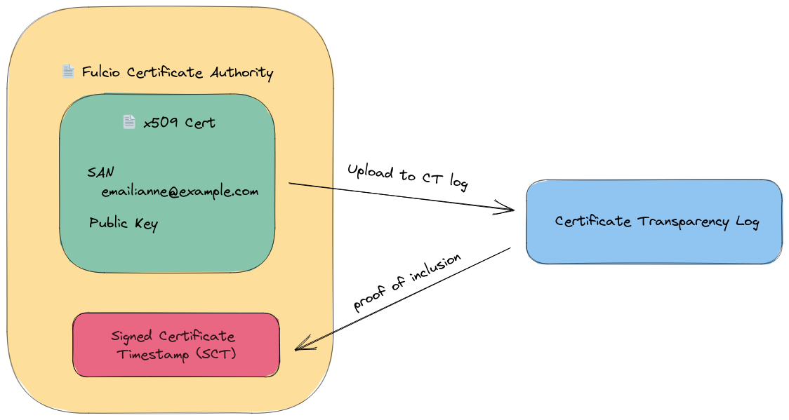
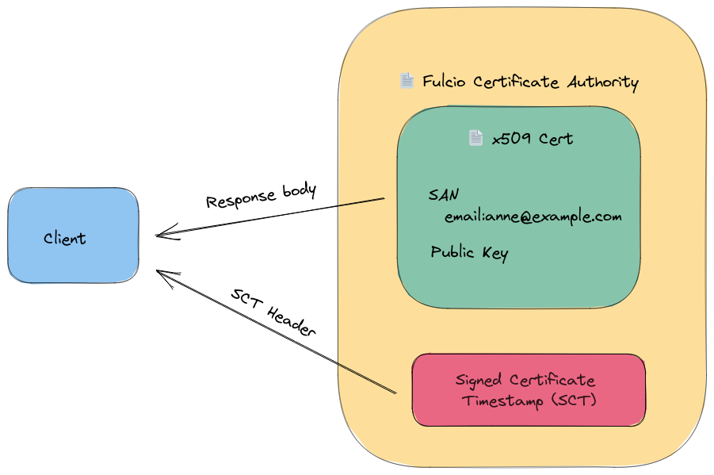

# Certificate Issuing Overview

This document walks through the process of issuing a code signing certificate
from start to finish. This is a great entry point to understanding how Fulcio
works if you're interesting in contributing to the project or just want to
learn more about whats happening under the hood.

## 1 | Certificate Request Input

To begin, the client submits a certificate request to Fulcio.

The certificate request contains three items:

- An OIDC identity token. This is a JWT containing information about the
  principal (identity of our client), the issuer (who verified this identity?
Google, Github etc) and some other metadata.
- The public key. This is the public half of an asymmetric key-pair generated
  by the client. The public key will be embedded in the final x509 certificate
if this request is successful
- A challenge. This challenge proves the client is in possession of the private
  key that corresponds to the public key provided. The challenge created by
signing the subject portion of the OIDC ID token

## 2 | Authentication

The first step in processing the certificate request is to authenticate the
OIDC ID token.

To authorize the token Fulcio must:

- Use the issuer claim from the token to find the issuers OIDC discovery
  endpoint
- Download the issuers signing keys from the discovery endpoint
- Verify the ID token signature

## 3 | Verifying the challenge

Once the client has been authenticated, the next step is to verify the client
is in possession of the private key of the public key they’ve submitted. To do
this we must verify the challenge. This is simply a signature of the `sub`
claim so we verify the signature using the public key supplied.

## 4 | Constructing a certificate

The client is now authorized and has proved they own their private key so we
can issue a code signing certificate for them.

At a high level this looks like

- Embedded the provided public key in the certificate
- Setting the subject alternative names to match the `sub` claim from the OIDC
  ID token (NB: this is email or URI depending on the type of issuer. Email for
Google, but URI for SPIFFE for example)
- Setting various other customer x509 extensions depending on the metadata in
  the OIDC ID token claims (e.g the github tag or commit etc)

## 5 | Signing the certificate

Our code signing certificate is now complete in detail, but needs to be signed
by certificate authority so that it becomes connected to Fulcio's chain of
trust.

Fulcio supports several certificate authority backends:

- PKCS#11: This works with any PKCS#11 devices including AWS CloudHSM,
  [softHSM] and others
- Google Private CA: A hosted certificate authority create by Google Cloud
  Platform
- Files: A simple private key and certificate on disk
- Ephemeral: An in-memory key-pair generated on start up 

[softHSM]: https://www.opendnssec.org/softhsm/

## 6 | Certificate Transparency log upload

Once the certificate is signed, there is one final task to complete before
returning the certificate to the client: upload to a certificate transparency
log.

The certificate transparency log returns a _Signed Certificate Timestamp_
(SCT).  The SCT indicates the log index for the certificate, a timestamp of
when it was included and the whole thing is signed by the certificate
transparency log.

## 7 | Return certificate to client

Finally, we return both the certificate and SCT to the client!

